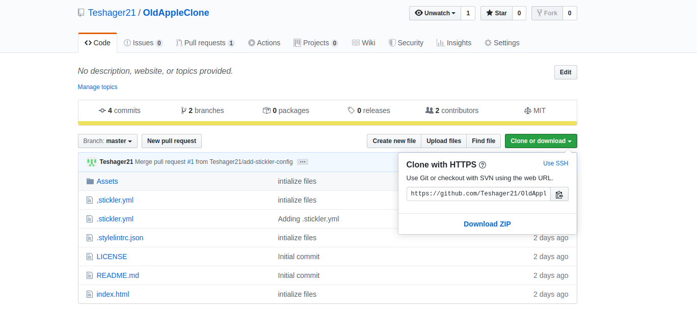

# Ruby Enumerable methods

In this project,we implemented the bubble sort algorithm. We focused on the use of yield and passing a block to a method.

## Built With

- Ruby-2.5.1p57

## Demo

## Milestone

## Getting Started

To get a local copy up and running follow these simple example steps.

### How to install using Command line

    1. Click on the install or download button under the repository name and grab the url
    by clicking on the clipboard icon

    2.open your terminal

    3.Navigate to the location in your computer where you want the repo to be cloned

    4. Type git clone  and paste the url you copied on step one.

        $ git clone https://github.com/YOUR-USERNAME/YOUR-REPOSITORY

    5. Press Enter. Your local clone will be created.

                $ git clone https://github.com/YOUR-USERNAME/YOUR-REPOSITORY
                > Cloning into `Spoon-Knife`...
                > remote: Counting objects: 10, done.
                > remote: Compressing objects: 100% (8/8), done.
                > remove: Total 10 (delta 1), reused 10 (delta 1)
                > Unpacking objects: 100% (10/10), done.

### Usage

    In any browser, open the index.html file

## Authors

👤 **Author**

- Gmail: [Teshager Admasu](mailto:teshager8922@gmail.com)
- Github: [@teshager21](https://github.com/teshager21)
- Twitter: [@Teshage84907805](https://twitter.com/Teshage84907805)
- Linkedin: [Teshager Admasu](https://www.linkedin.com/in/teshager-admasu-0000011a2/)

## 🤝 Contributing

    Contributions, issues and feature requests are welcome!

Feel free to check the [issues page]().

## Show your support

Give a ⭐️ if you like this project!

## Acknowledgments

- [Microverse](https://www.microverse.org/)
- [Odin Project](https://www.theodinproject.com//)
- [Github](https://github.com/)

## 📝 License

This project is [MIT](lic.url) licensed.
